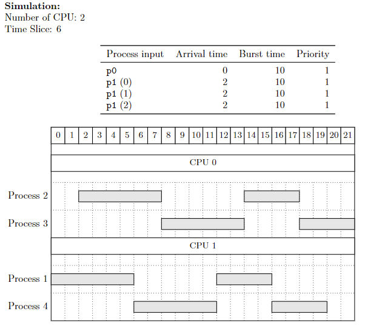
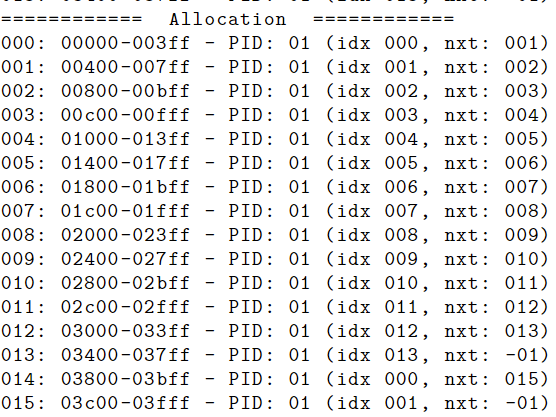

<!-- icons  -->
[1.1]: https://img.shields.io/badge/GitHub-100000?style=for-the-badge&logo=github&logoColor=white
[2.1]: https://img.shields.io/badge/LinkedIn-0077B5?style=for-the-badge&logo=linkedin&logoColor=white
[3.1]: https://img.shields.io/badge/Medium-12100E?style=for-the-badge&logo=medium&logoColor=white
[4.1]: https://img.shields.io/badge/Twitter-1DA1F2?style=for-the-badge&logo=twitter&logoColor=white

<!-- links to your social media accounts -->
[1]: https://github.com/produdez
[2]: https://www.linkedin.com/in/produdez/
[3]: https://medium.com/@produde
[4]: https://twitter.com/_Produde_

# Simulating a simple OS

    

**Description:**

Simulation of scheduling, synchronization and memory management of an operating system with C code.

Detailed report [here](https://www.overleaf.com/read/qpqmsbnmnbzr)

> Disclaimer: we focus on assignment 2 in this description, please ignore lab9 and assignment 1

## General Information

- Code is all in `Assignment2` folder
- Header files in `include` are predefined structure that's essential for simulating the OS components
- Other predefined files by our teacher `./src`:
  1. `timer.c`: OS timer
  2. `cpu.c`: The virtual cpu
  3. `paging.c`: Just to check the Virtual Mem Engine
  4. `os.c`: Structure of the whole OS
  5. `loader.c`: OS loader

- Our work are in these files below:
  1. `sched.c`: implement the process of getting process from and give back to queue
  2. `queue.c`: implement queueing of processes
  3. `mem.c`: implement memory functionalities (get page table, alloc, free)

## Screenshots

1. A test run that we did with 2 CPUs and 4 processes
    
    
2. Example log of memory allocation
    
    

## Acknowledgements

- Many thanks to [@phhai-hcmut](https://github.com/phhai-hcmut) (the other contributor to this project)
- Though the code was originally not on github.com so his contribution is not recorded through the site (name still in report of course)

## Contact

Created by [@produdez](https://github.com/produdez) - feel free to contact me or follow my blog on medium ❤️!

<!-- [![alt text][1.1]][1] -->
[![alt text][2.1]][2]
[![alt text][3.1]][3]
[![alt text][4.1]][4]
